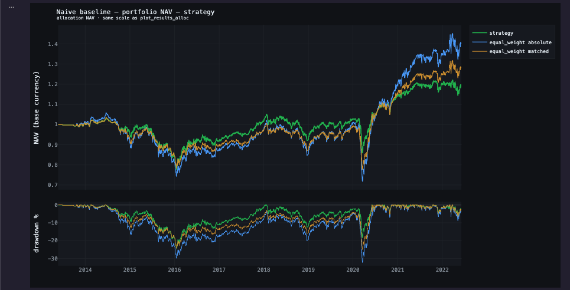
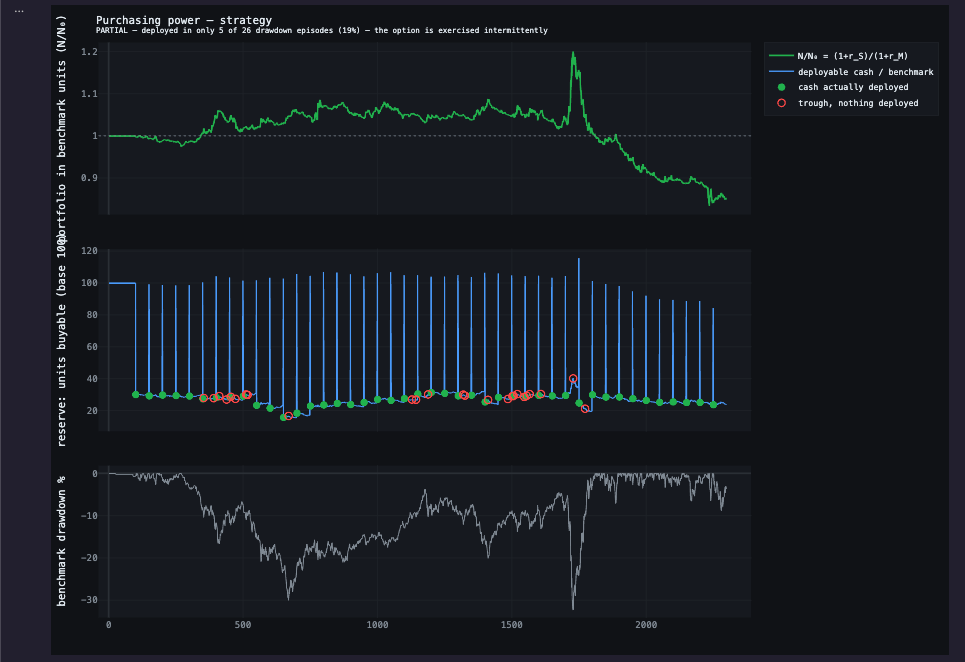
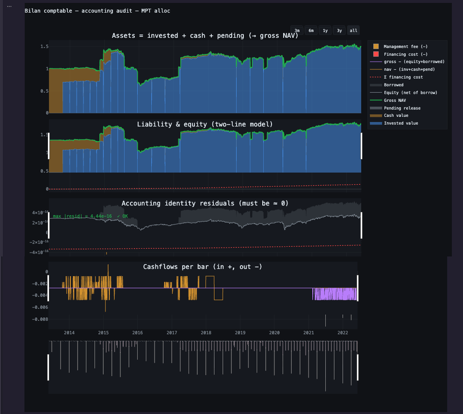

# Multi-Strategy Backtest Engine

[](https://github.com/Arnaud-BARBIER/Multi-strategy-backtest-engine/actions/workflows/tests.yml)

**A backtesting engine where refuting a result costs one line, which is why it happens.**

**[arnaud-barbier.github.io/Multi-strategy-backtest-engine](https://arnaud-barbier.github.io/Multi-strategy-backtest-engine/)**
 — the validation note, the engine page, and the numbers below in context.

---

## What this is

Two halves that are only worth anything together.

**An accounting core.** A Numba-compiled multi-asset kernel over a ledger that closes:
cash tiers, borrow tranches with overnight carry, multi-currency, accrued fees,
dividends. Its job is to make a number *real*, to ensure that the return being measured
is one an account could actually have earned, after financing, fees and currency.

**A validation layer.** Baselines, nulls, sample-size accounting, carrier resolution. Its
job is to say when that number *means nothing*.

The design constraint is the cost of the second half. Refuting a result properly, a
volatility-matched baseline, a sizing null, a reachable frontier, in/out-of-sample
discipline, normally takes longer than producing the result in the first place, which is
why it is usually skipped, and why it stays an intention rather than a practice. Here a
run records itself, and each refutation is a single call against that record.

That is the whole point, and it is the reason for the result below. The strategy was not
refuted out of virtue. It was refuted because refuting was the cheapest thing to do.

---

## Result

Textbook mean-variance optimisation, run through the validation layer, does not beat
equal weighting on this configuration, and the layer reports that it cannot detect a
sizing effect either way.

| | strategy | 1/N absolute | 1/N matched | gap vs absolute |
|---|---:|---:|---:|---:|
| CAGR | 1.94 % | 3.80 % | 2.78 % | **−1.86 pt** |
| annualised volatility | 8.14 % | 12.26 % | 9.32 % | −4.12 pt |
| max drawdown | −24.76 % | −32.28 % | −25.03 % | +7.52 pt |
| certainty equivalent, γ = 3 | 1.26 % | 2.23 % | 1.88 % | −0.96 pt |

**Verdict: `ADDS_NOTHING`**, the certainty equivalent is 0.96 pt/year lower at γ = 3.

Both baselines are rebuilt by the engine itself, through the same accounting machinery as
the strategy. They pay the same 2 % management fee and the same 5 % performance fee, on
the same clocks, and they are read on the same performance carrier. **The only thing
swapped is the weighting rule.** A baseline computed gross of fees against a strategy
computed net is the most common way to manufacture an edge that does not exist; here it is
not possible, because the baseline is not computed, it is *run*.

Two things this run does *not* charge, stated so the test is not credited with more
severity than it had. Execution costs are declared but do not bind: in allocation mode
they go through a lot-based path, and measured slippage is zero. And this run carries no
currency spec, so no translation happens on either side. Both absences apply equally to
the strategy and to the baselines, so the comparison stays fair; they simply make it a
less demanding test than the declaration suggests.

The two levels differ in one respect: `absolute` strips the cash reserves and stays
invested, `matched` keeps every piece of machinery including the 30 % of reserves. The
gap between them is therefore the price of the cash policy, isolated.



*The strategy loses less in every trough, which is the −24.76 % against −32.28 %, and does
not take back what it never lost: the three curves track each other until 2020, then the
post-crisis recovery pulls the baselines away. Almost all of the −1.86 pt forms there.
Unedited output of `validation_baseline`.*

Run: 5 assets, daily bars, 2013–2022 in-sample, 2,298 bars, 46 rebalance decisions,
50-bar rebalance interval, 100-bar covariance lookback. 2022–2026 is held out and has
not been looked at.

**The strategy under test.** A rolling portfolio optimiser on a downside-risk objective:
it minimises the longest underwater duration observed over the estimation window. At
every 50th bar it re-estimates over the trailing 100 bars and solves for long-only
weights, capped at 35 % per asset, with any weight below 1 % dropped to zero, using 6
seeded restarts warm-started from the previous weights. The cap forces at least three
positions and the floor lets the optimiser drop names, so the basket varies between three
and five. The book is rebalanced to those weights and held until the next decision.

On top of it sits the cash policy under test: a 20 % dynamic reserve and a 10 % fixed
reserve, a 2 % annual management fee accrued yearly and paid quarterly, a 5 %
performance fee with a high-water mark, and execution costs declared but not binding
(see above).

Nothing proprietary, it is a textbook construction, used here as a subject with a known
answer.

The question is not whether it makes money. The question is whether the framework can
tell.

The finding sits in a known family. DeMiguel, Garlappi & Uppal (2009), *Optimal Versus
Naive Diversification*, show that 1/N beats mean-variance out of sample across most of
the datasets they test, because estimation error on the inputs costs more than the
optimisation recovers. The objective used here is a downside-risk one rather than
mean-variance, so this is not a replication of their result, but it is the same
mechanism: a rule fitted to a 100-bar window, applied to the next 50 bars, losing to a
rule that estimates nothing.

---

## Where the gap comes from

The −1.86 pt is decomposed, not asserted, and each component is reported with the
sample size that would be needed to settle it.

| component | difference | t | reading |
|---|---:|---:|---|
| weighting, strategy vs 1/N with identical machinery | −0.84 pt | −0.63 | not detectable |
| cash policy, the 30 % of reserves, isolated | −1.02 pt | −1.37 | not detectable; ~99 decisions would be needed |
| **total**, strategy vs 1/N fully invested | **−1.86 pt** | | |

The sizing null works by keeping the basket the strategy chose at each rebalance and
replacing its weights with equal weights inside that basket. The optimiser's output is
destroyed; everything else, dates, names, cash, fees, costs, is held fixed. What
disappears is exactly the information the optimiser claims to add.

Two things are worth stating plainly.

**Neither component is distinguishable from zero.** The honest reading is not "the
optimiser adds nothing" and not "the cash policy costs 1 pt". It is that 46 decisions
cannot resolve effects of this size, and the layer says so rather than reporting the
point estimates as findings:

```
N_eff = 46 decisions -> nothing finer than p ~ 0.02 is resolvable here
```

**The mechanism that is supposed to earn its keep is the one that shows least.** The
optimiser, the part with the mathematics in it, the part that justifies the whole
construction, moves the result by −0.84 pt with a t of −0.63. Meanwhile the plumbing
underneath it, a cash reserve rule with no theory behind it at all, moves it by more.
That ordering is the result.

### Stochastic discount factor, does the cash actually pay in bad states?

The framework holds cash and redeploys it. The question is whether that cash arrives
when it is worth the most, or merely reduces exposure everywhere.

| weighting | mean return per deployment |
|---|---:|
| unweighted | 0.0089 % |
| m-weighted, γ = 1 | 0.0065 % |
| m-weighted, γ = 3 | 0.0014 % |

Returns are weighted by the stochastic discount factor m ∝ (1 + r_M)^(−γ), so states of
the world where the benchmark fell count for more.

The weighted return **falls** as γ rises. Deployments do not concentrate in bad states.
This is de-risking, not insurance, the distinction that a raw return comparison cannot
make.

Supporting counts: 26 benchmark drawdown episodes below −10 %; cash deployed in 5 of
them (19 %); 44 deployments in total, 99.4 % of them into the book rather than into
fees; mean cash holding 30.9 % of NAV.

**Verdict: `PARTIAL`.**



*The middle panel is the test. The blue stems measure how many units of the benchmark the
reserve could buy at each date, so they rise when the market falls and the option does carry
value. The green dots mark where cash was actually deployed, the red circles the troughs
where it was not. The dots do not cluster under the peaks.*

Identity used, and tested by strict equality in the test suite: the purchasing-power
weight 1/(1 + r_M) *is* the stochastic discount factor at γ = 1. The two code paths must
return bit-identical results.

---

## Was the strategy's risk profile worth paying for?

The strategy carries 8.14 % volatility against the benchmark's 12.26 %. Comparing their
raw returns is meaningless: it takes less risk, so it should return less. The question
that matters is whether an investor needed the model at all to obtain that risk profile.

They did not. Holding 66.4 % of the benchmark and 33.6 % in cash reproduces the
strategy's volatility exactly, by construction, with two instruments and no estimation.
That blend is the reachable frontier, and it is what the strategy has to beat.

| assumed risk-free rate | strategy − blend |
|---|---:|
| 0.0 % | −0.74 pt |
| 2.0 % | −1.42 pt |

**Verdict: `DOMINATED`**, below the capital market line at every risk-free rate tested.
The same risk was available with more return by simply holding less of the benchmark.

The rate is swept, not assumed, because the conclusion depends on it. Over the tested
range the sign never changes, and extrapolating the relationship, it would take a
risk-free rate below roughly −2 % to flip the verdict, which is to say the conclusion
does not rest on the assumption.

One correction matters here and it works against the strategy. A de-levered blend suffers
less volatility drag than the benchmark, so its compounded return sits *above* the
straight line drawn between cash and the benchmark: the reachable frontier bows upward,
by (σ²/2)·w·(1−w) ≈ 0.17 pt at this weight. Judging the strategy against the straight
line would have understated the blend and flattered the strategy by that amount. The
curve is used instead.

---

## What this framework refuses to do

Most of the engineering effort went into the cases where the correct output is an error,
not a number.

**It refuses to produce a number it cannot support.**
- Comparing an in-sample result to an out-of-sample result raises, rather than returning
  a flattering difference.
- Estimating over a period with no data raises.
- A decision function that receives no returns raises, instead of silently sizing on
  zeros.

**It refuses to report significance it did not earn.**
- No p-value is attached to a deterministic baseline. Equal-weight is a single object,
  not a distribution: the output is a difference, and the report says so.
- Effective N counts **decisions**, not bars. 2,298 bars is not 2,298 observations; 46
  rebalances is the sample size, and the t-statistic sums differences per rebalance
  period before testing.
- Tightening the rebalance grid buys no statistical power. At constant history, going
  from n to 2n blocks leaves t invariant. This is demonstrated in the test suite
  specifically so that the behaviour cannot be gamed.

**It refuses to hide an assumption inside a point estimate.**
- Where a conclusion depends on an input, the reported output is the **threshold at
  which the conclusion flips**, not a single number derived from a convenient
  assumption. The risk-free rate is swept, never assumed.
- The reachable frontier is not treated as a straight line. A de-levered blend suffers
  less volatility drag, so the true frontier bows above the naive interpolation between
  cash and the benchmark. Judging the strategy against the straight line would flatter
  it. It is judged against the curve.

**It refuses to let the wrong series be measured.**

The series that carries performance depends on the execution mode: closed trades in
algorithmic mode, NAV-equity in allocation mode, `strategy_twr_index` in investment mode.
Reading the wrong one produces numbers that are wrong and silent, a measured case in
this project reported a −11.1 % drawdown where the correct carrier gave −5.2 %. Carrier
selection is therefore resolved by the mode, not by the caller.

---

## Accounting

**Weights are the unit of the *weighted return*. They are not the unit of what an account
actually earned.** Everything between those two quantities, management and performance
fees on their own clocks, execution costs that depend on turnover rather than position,
financing whose carry depends on how long a borrow tranche has been open, currency
translation, drift between rebalance dates, lives outside the space of weights. This
engine exists to compute that difference.

It is also what makes the nulls above legitimate. The sizing null perturbs the weight
channel *while freezing everything else*: same dates, same fees, same costs, same
currencies. That freeze is what makes −0.84 pt attributable to the optimiser. Without an
accounting core there is nothing to freeze, and the fee load wanders into the residual,
which is how a strategy net of fees ends up being compared against a baseline that is
not.

The ledger itself is verified by identities that must close, not by a list of supported
features.

| identity | enforced where |
|---|---|
| `NAV_gross = NAV_equity + borrowed` | every bar |
| cash ledger sums to zero across all flows | every bar |
| fee accrued over the year = Σ quarterly payouts | period boundary |
| purchasing-power weight at γ = 1 ≡ SDF at γ = 1 | strict equality test |



*Assets decomposed, the two-line liability model, and the residuals of both identities. The
worst residual over 2,300 bars with borrowing, currency conversion, fees and watchers active
is 4.44e−16: on a 100,000 portfolio, a gap of four billionths of a cent between what it owns
and what it owes. The residual panel is never resampled for display, because a spike lasting
one bar is exactly what it exists to catch.*

What the ledger models, all of it exercised by the identities above rather than merely
implemented:

- **Cash tiers**, fixed and dynamic reserve, tappable cushion, deep-reserve vault with
  auto-restore
- **Borrowing**, persistent tranches with overnight carry, closed only by policy
  (margin, expiration) or by an explicit action, per-asset and per-group targeting
- **Multi-currency**, cross-rate triangulation when the base currency and the asset
  currencies do not share a leg
- **Fees**, management fee accrued annually and paid quarterly, on NAV / on profit / on
  both; performance fee with high-water mark
- **Income**, dividends as an FX-neutral cash flow
- **Intra-period watchers**, barwise scanning with a per-period fire budget, so a
  triggered rule cannot silently rewrite the whole path

This layer is the part of the project that is least visible in a performance chart and
most visible in a due-diligence conversation.

---

## Architecture

**What is published.** This repository is a snapshot of the algorithmic engine as it stood
in April 2026, enough to define a signal, run it under a realistic execution model, and
inspect the resulting trades. It is a working subset, not a reduced demo: the tests below
run against it.

**What is not.** The allocation and investment engine that produced the results above is
private, the ledger, the cash and borrowing machinery, the fee accrual, the currency layer,
and the validation layer itself. It is covered by 401 tests. Every measurement on this page
comes from it, and every test described above is specified precisely enough to be
reimplemented against any return series.


A Numba-compiled multi-asset kernel underneath; the research surface stays in Python.
Three execution modes, algorithmic, allocation, investment, share one accounting core,
which is why the carrier-selection rule above is enforced rather than documented.

Signal logic and execution assumptions are kept separate by construction: a strategy
expresses intent, and never sees fills, costs, or cash. That separation is what makes the
nulls below possible at all, the sizing null works by wrapping the decision function and
flattening its output, which is only well-defined if the decision function does not know
about execution.

### Validation layer

The measurements above come from this layer. It is not in this repository; the table
records what each module is responsible for, so the method can be reimplemented.

| module | responsibility |
|---|---|
| `validation_run_record.py` | automatic run capture and replay primitive |
| `validation_window.py` | IS/OOS cloning with a declared warm-up |
| `validation_naive_baseline.py` | two-level baseline: reserves stripped, or every piece of machinery kept |
| `validation_nulls.py` | sizing null, wraps the decision function, flattens magnitudes |
| `validation_sdf.py` | purchasing power as a stochastic discount factor |
| `validation_leverage.py` | reachable frontier, volatility and drawdown matching |
| `validation_performance.py` | carrier resolution by mode, triage, PSR / MinTRL, CE, γ* |
| `spec_template.py` | prints a spec as a form to be filled in |

---

## Limits

Written deliberately, because the argument of this repository is that stated limits are
worth more than an equity curve.

- **46 decisions.** That is the sample size. Effects smaller than roughly 2 pt of CAGR
  are not establishable here by any method, and the report says so rather than reporting
  them.
- **One regime.** 2013–2022 is a single macro environment. Nothing here generalises to a
  regime the sample does not contain.
- **One configuration.** Five assets, a 50-bar rebalance, a 100-bar lookback. The result
  is a statement about this configuration, not about mean-variance optimisation in
  general.
- **The out-of-sample window has not been used.** 2022–2026 is reserved. Reporting it now
  would convert it into a second in-sample.
- **Costs are modelled, not observed.** Spread, slippage, commission and borrow carry are
  parameters, and no claim is made that they match any specific broker.

---

## Installation

```bash
pip install "git+https://github.com/Arnaud-BARBIER/Multi-strategy-backtest-engine.git@main"
```

## Tests

```bash
python -m unittest discover -s tests -v
```

---

## Examples

`examples/run_example.py`, a minimal end-to-end run: data in, signal, execution, trades out.

`examples/Framework_Research_Workflow_Demo.ipynb`, the full algorithmic workflow: features,
setups, regime routing, post-trade analysis. It is a large notebook and renders slowly on
GitHub; clone it to read it comfortably.

The allocation notebook that produced the results at the top of this page runs against the
private engine and is not published here.
